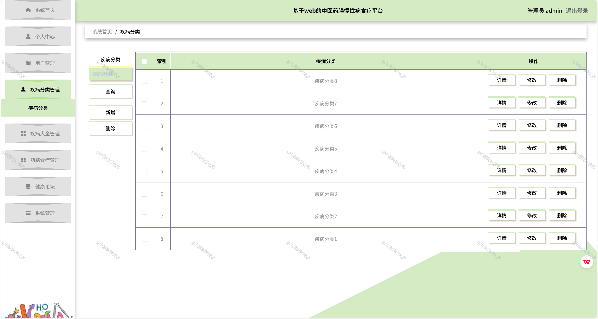

# python075
python075基于Python+Django的中医药膳慢性病食疗系统+LW+PPT
 
## 查看主页获取源码

### 一、关键词
中医食疗慢性病药膳系统，中医膳食慢性病食疗系统，中医药膳慢病食疗体系

### 二、作品包含
源码+数据库+设计文档万字+PPT+全套环境和工具资源+本地部署教程

### 三、项目技术
前端技术：Vue2.0、Element-ui
后端技术：Python3.7、Django2.0

### 四、运行环境（以下版本亲测，其他版本兼容性请自行测试）
开发工具：PyCharm + VSCODE

数据库：MySQL5.7（最低要5.7版本）

数据库管理工具：Navicat10+

Python：Python3.7

前端Nodejs：14

浏览器：谷歌浏览器

### 五、项目介绍
项目编号：python075

为了方便用户更好的获得信息，因此，设计一种安全高效的中医药膳慢性病食疗平台极为重要。为设计一个安全便捷，并且使用户更好获取中医药膳慢性病食疗平台，本文主要有安全、简洁为理念，实现用户快捷寻找中医药膳慢性病食疗平台，从而解决中医药膳慢性病食疗平台复杂难辨的问题。
系统包括管理员和用户二部分。同时还能为用户提供一个方便实用的中医药膳慢性病食疗平台，使得用户能够及时地找到合适自己的中医药膳慢性病食疗平台。管理员界面管理用户的信息，也可以对系统上的所有信息进行修删除查等操作，用户通过本系统可以及时了解中医药膳慢性病食疗平台。

### 六、运行截图

